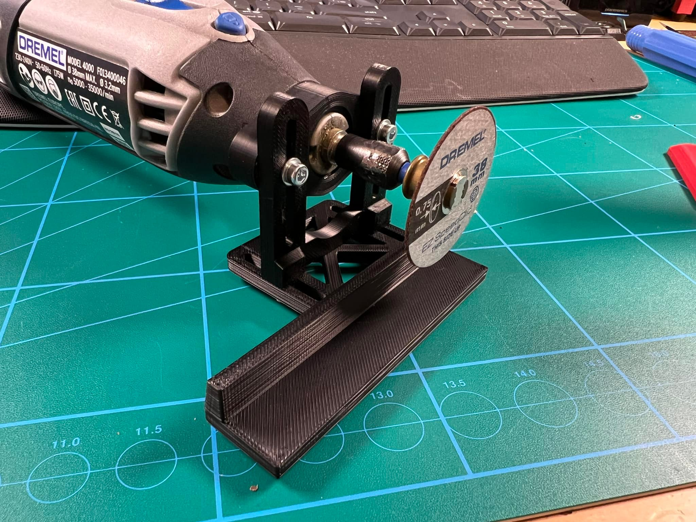
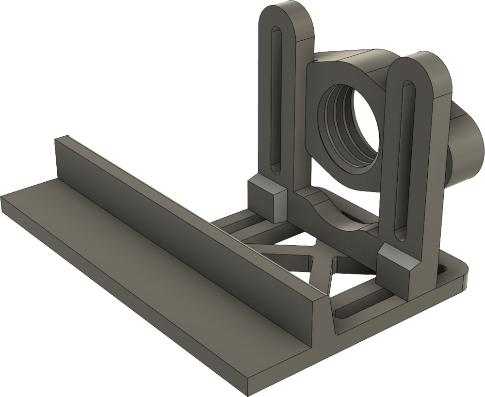
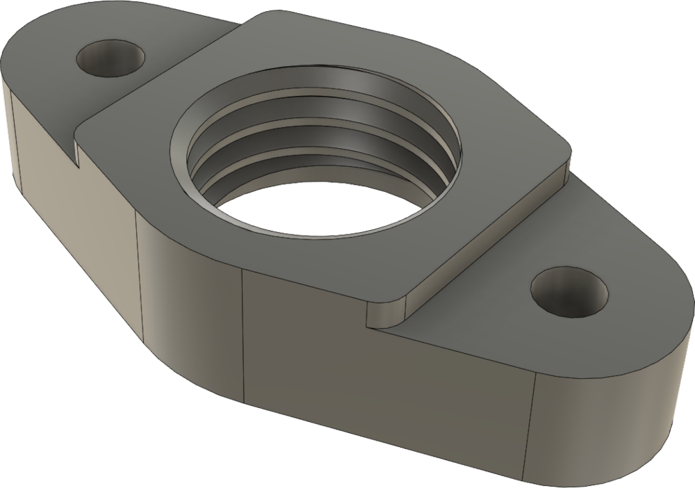
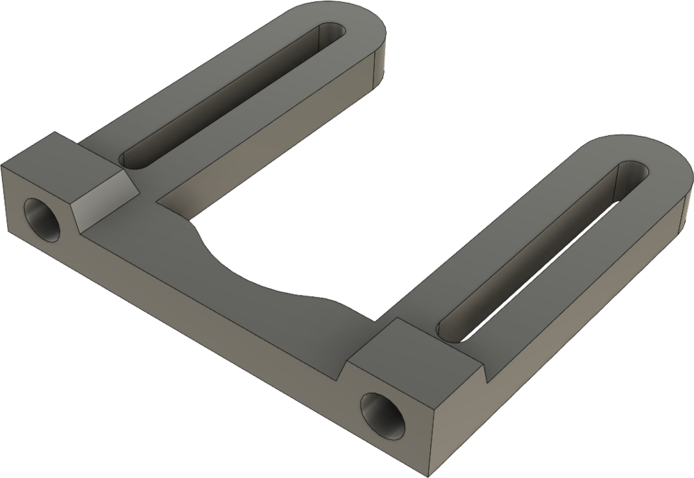
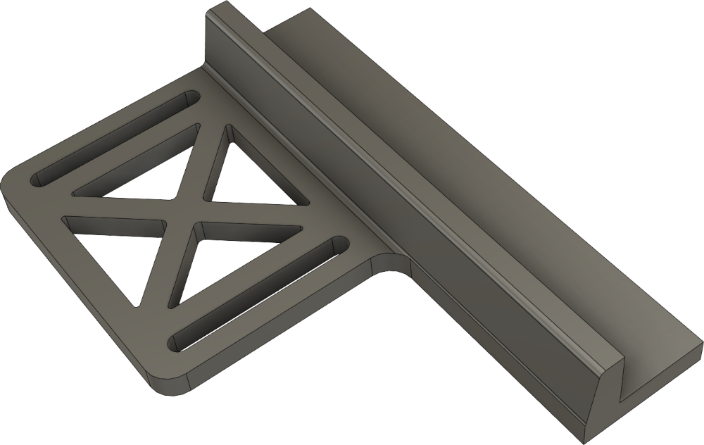

# Dremel guide

Dette værktøj kan monteres direkte på en dremel til at styre/guide et emne

# BOM

| Antal | Beskrivelse         | Evt. link                                                                                                                                        |
| ----- | ------------------- | ------------------------------------------------------------------------------------------------------------------------------------------------ |
| 4     | 8mm M3 skruer       | [skruebissen.dk](https://skruebissen.dk/unbrako-din-912/unbrako-bolte-din-912-elforsinket-kval-88.html#/6121-din_912_elforsinket-50_stk_pk_m3x8) |
| 4     | Ø3.2 skiver         | [skruebissen.dk](https://skruebissen.dk/skiver/skive-din-125a-elforsinket.html)                                                                  |
| 4     | M3 Heat Inserts     | [3do.dk](https://3do.dk/tilbehor/338-ldo-heat-insert-tool.html)                                                                                  |
| 1     | [Krave](#krave)     | [STL](02-dremelguide/stl/krave.stl) - [STEP](02-dremelguide/step/krave.step)                                              |
| 1     | [Afstand](#afstand) | [STL](02-dremelguide/stl/afstand.stl) - [STEP](02-dremelguide/step/afstand.step)                                                                                                   |
| 1     | [Fod](#fod)         | [STL](02-dremelguide/stl/fod.stl) - [STEP](02-dremelguide/step/fod.step)                                                                                                           |

## Færdig løsning

## STL's

Sådan ser den ud når den er samlet

### Krave
* [krave.stl](02-dremelguide/stl/krave.stl)
* [krave.step](02-dremelguide/step/krave.step)

### Afstand
* [afstand.stl](02-dremelguide/stl/afstand.stl)
* [afstand.step](02-dremelguide/step/afstand.step)

### Fod
* [fod.stl](02-dremelguide/stl/fod.stl)
* [fod.step](02-dremelguide/step/fod.step)

